# abz.agency® TestTask

This project is a test task for abz.agency.

## 📲 Description

# Test Assignment

1. **Mockups**: Implemented splash screen and 3 simple screens from the Figma project.

2. **GET Request**:
   * Screen "Working with GET request" displays 6 users, sorted by newest registration date.
   * Scrolling loads next 6 users. Radio buttons use GET /positions API.

3. **POST Request**:
   * Screen "Working with POST request" includes form validation per mockups and API.
   * Business logic implemented; new user appears on GET request screen post-registration.

4. **Offline Mode**: Relevant offline screen implemented.

# Technical Requirements

1. **Functional**: Works on latest iOS version in portrait mode.

2. **Non-Functional**:
   * **Performance**: Runs quickly and smoothly.
   * **Language/Frameworks**: Swift, SwiftUI.

3. **Deliverables**:
   * **Source Code**: Well-commented, organized, and maintainable.
   * **README**: This file.
   * **Documentation**:
      * APIs: Used REST API (GET/POST) as per documentation for user data and positions.
      * Code Structure: Organized into modules for splash, GET, POST, and offline screens.

## Configuration

* Customize API endpoints in the configuration file if needed.
* No external libraries used beyond standard SwiftUI.

## 🛠 Tech Stack

- ✅ Swift
- ✅ SwiftUI
- ✅ Git


## 🔗 API

```bash
https://openapi_apidocs.abz.dev/frontend-test-assignment-v1
```

## 📸 Demo

<p align="center">

</p>

## 📸 App Screencast

<p align="left">
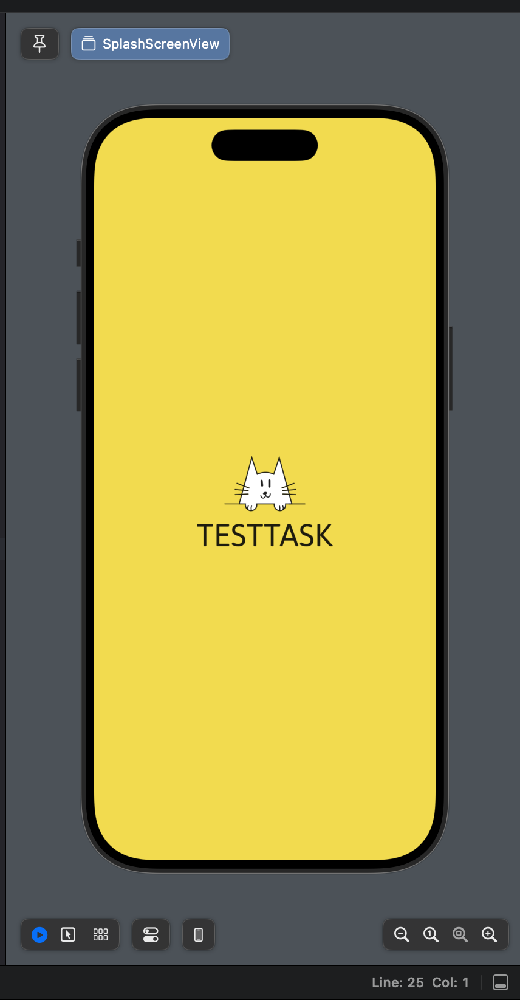
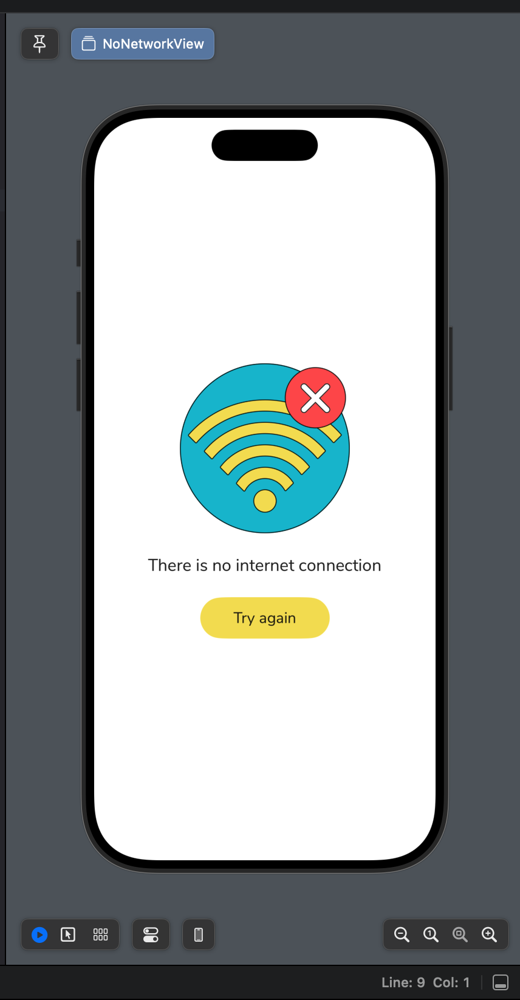
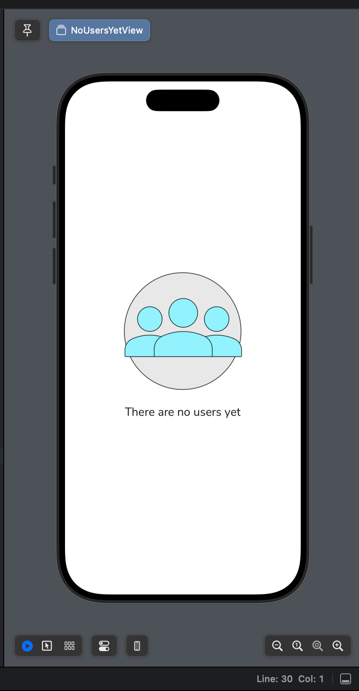
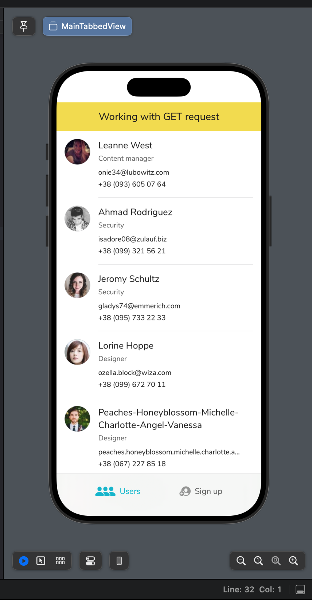
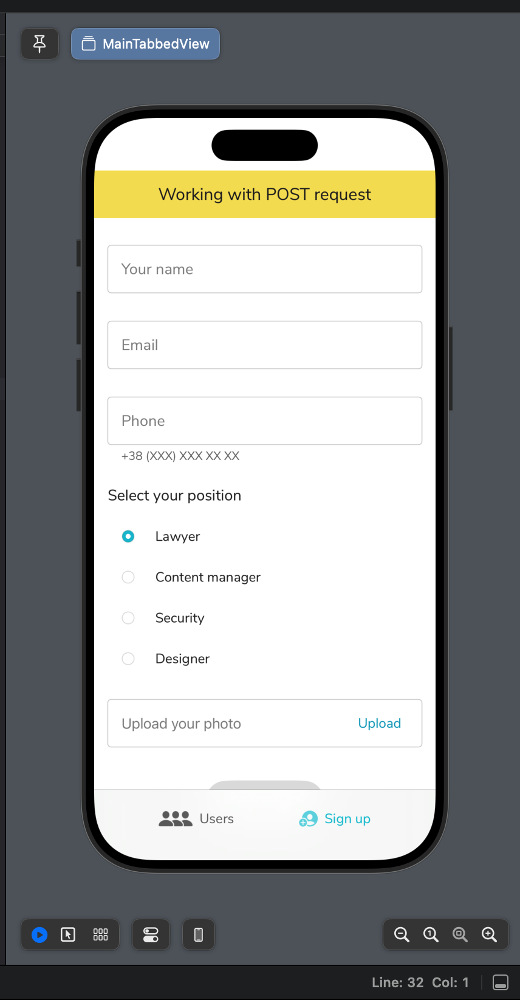
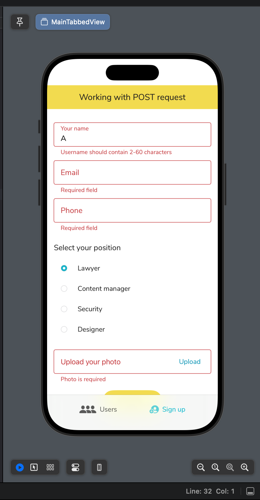


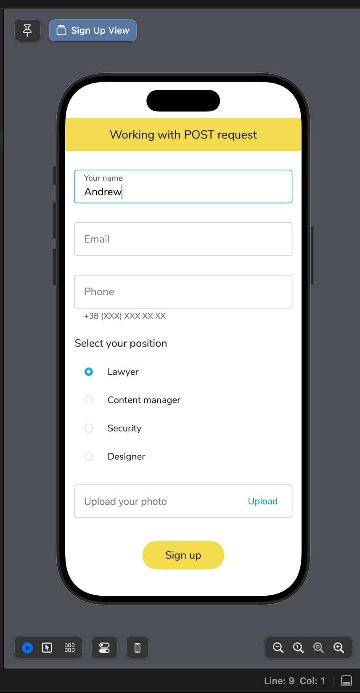
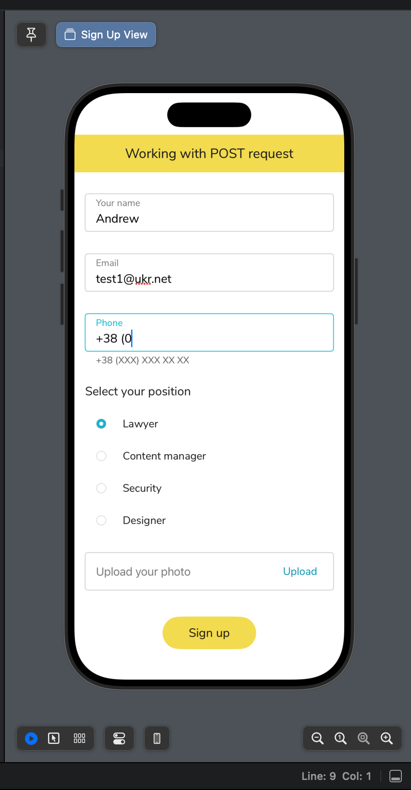
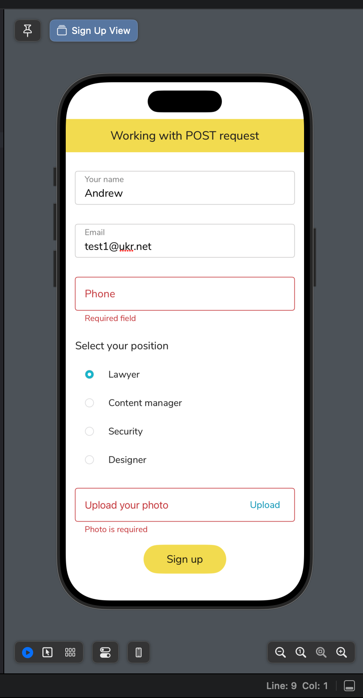
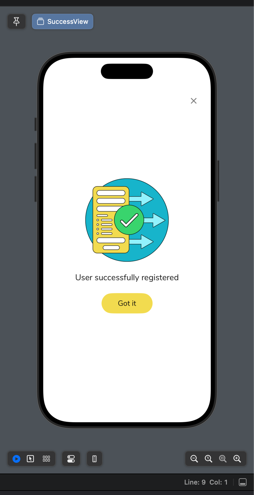
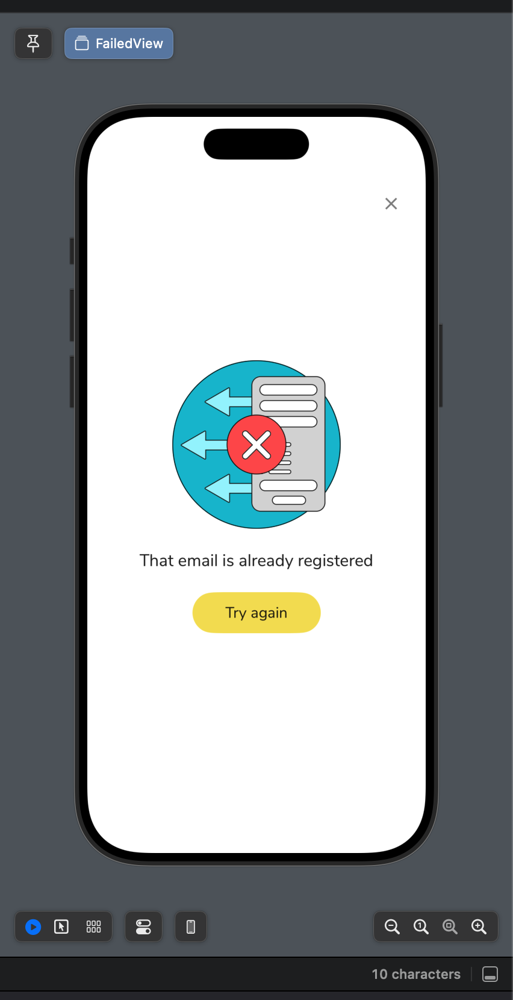
</p>
